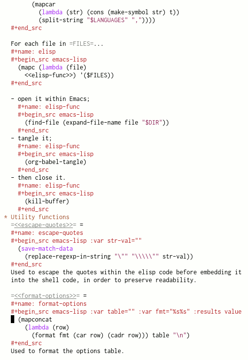
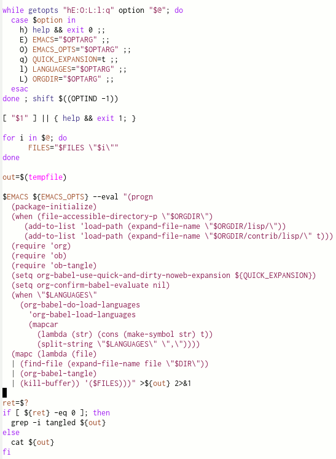
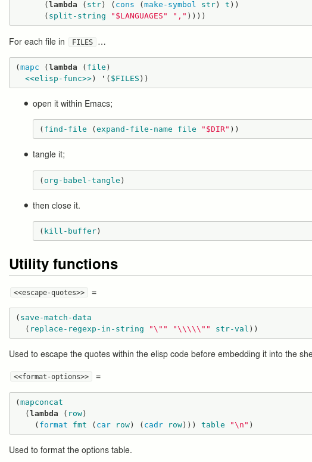

> Humanity is The Big Story, which, in turn, is broken down into very many sub-Stories. We're Story-oriented. Code so far is not. Code is like networks of tunnels where, for all intents and purposes, most of the tunneling has already collapsed, the tunnel paths mostly unknowable. 
> 
> What makes me so excited about org mode is that it's the first time I've seen literate programming move a tick up into the realm of actually creating a tellable Story.
> 
> &#x2013; [Lawrence Bottorff, Feb 2014](https://lists.gnu.org/archive/html/emacs-orgmode/2014-02/msg01022.html)

# What is it ?

`org-noweb` is a couple of programs who make [literate programming](http://en.wikipedia.org/wiki/Literate_programming) with [Org](http://orgmode.org) easier.

-   [org-tangle](./org-tangle.md) takes one or several org files as arguments and produces programs
-   [org-weave](./org-weave) takes an org file as an argument and produces, on standard output, source code for typeset documentation.

Org already comes "batteries included" with (some) literate programming abilities, thanks to Eric Schulte and Dan Davison ; but these features are meant for interactive use, with a running Emacs instance.

`org-noweb` brings these features to the command line, allowing code and documentation to be generated non-interactively. If you care about build automation, that's just what you want.

`org-tangle` and `org-weave` themselves are written in literate Org documents, and this repository is managed using <a href="#the-makefile-used">these GNU Makefile rules</a>:

-   **org-tangle:** [program](./org-tangle) | [documentation](./org-tangle.md) | [source document](./org-tangle.md)
-   **org-weave:** [program](./org-weave) | [documentation](./org-weave.md) | [source document](./org-weave.md)

## What is Literate Programming ? Why should I care ?

I'd personnaly recommend these two resources:

-   [Literate Programming in the Large](http://daly.axiom-developer.org/TimothyDaly_files/publications/DocConf/LiterateSoftwareTalk.html), a talk presented by [Timothy Daly](http://daly.axiom-developer.org/) at Write The Docs conference (April 2013) ([slides](http://daly.axiom-developer.org/TimothyDaly_files/publications/DocConf/LiterateSoftwareTalk.pdf))
-   [A nice introductory page](https://github.com/limist/literate-programming-examples) by Kai Wu (March 2014), packed with a collection of literate programming examples using Org.

# How does it work ?

Consider an Org document (`source.org`) containing source code interleaved with documentation:



Running `org-tangle source.org` will extract the source code blocks according to the `:tangle` directives within the `source.org` and generate, for instance:



Then, running `org-weave -f gfm source.org > source.md` will generate documentation in GitHub flavored Markdown.



# How to install it ?

1.  Clone this repository
    
    ```sh
    git clone https://github.com/ngirard/org-noweb
    ```
2.  Install `org-tangle` `org-weave` in a directory belonging to your `$PATH`
    
    ```sh
    cd org-noweb
    install -m 755 org-tangle org-weave /dest/dir
    ```

`org-weave` currently does nothing else than exporting to GitHub flavored Markdown ; it needs the `ox-gfm` package that was contributed by Lars Tveito. `ox-gfm` [currently doesn't belong](http://permalink.gmane.org/gmane.emacs.orgmode/87366) to the `org` / `org-plus-contrib` packages yet; so until then you'll need to

-   [grab it from Gmane](http://cache.gmane.org//gmane/emacs/orgmode/84702-001.bin) into a directory `dir`;
-   run `org-weave` using
    
    ```sh
    org-weave -f gfm -O '-Q --batch -L dir' file.org > file.md
    ```

# The Makefile used

<span id="makefile"/>

This is the Makefile file I'm using on my system to manage this repository.


```makefile
PROGRAMS=org-tangle org-weave
TARGETS=$(PROGRAMS) README.md org-tangle.md org-weave.md

all: $(TARGETS)

%: %.org
	org-tangle -l emacs-lisp,org $<

%.md: %.org
	org-weave -f gfm -O '-Q --batch -L ~/.emacs.d/local-packages' $< > $@

DESTDIR=/home/soft/bin
install: all
	install -m 755 $(PROGRAMS) $(DESTDIR)
```
